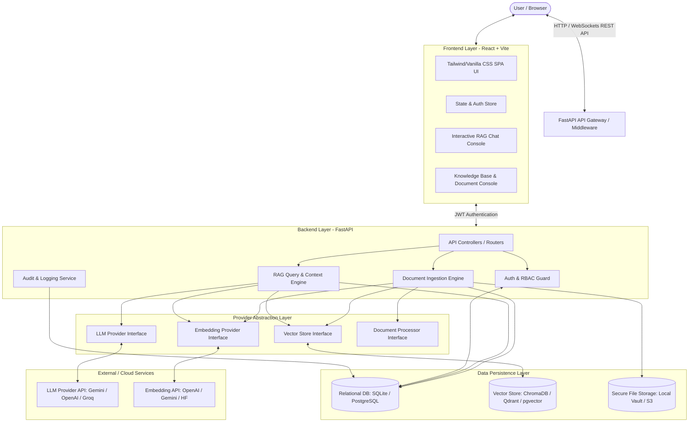

# RAG Enterprise AI Assistant — System Architecture

## 1. High-Level Architecture Overview

The system follows a modern, decoupled **Layered Client-Server Architecture** designed with strict separation of concerns, pluggable interfaces, and multi-tenant security guarantees.



---

## 2. Architectural Principles

### 2.1 Provider Independence & Loose Coupling
To avoid vendor lock-in and ensure the project remains adaptable, all core AI components (LLMs, Embeddings, Vector Stores, Document Processors) interact with the application solely through Abstract Base Classes (Interfaces).

```
   [ Application Services (RAG Engine / Ingestion Pipeline) ]
                              │
                              ▼
           ┌──────────────────────────────────────┐
           │     Abstract Interface Contracts     │
           │  (BaseLLM, BaseEmbedder, BaseStore)  │
           └──────────────────┬───────────────────┘
                              │
       ┌──────────────────────┼──────────────────────┐
       ▼                      ▼                      ▼
┌──────────────┐      ┌──────────────┐      ┌──────────────────┐
│ Gemini/OpenAI│      │ HuggingFace  │      │ Chroma / Qdrant  │
│ LLM Adapter  │      │ Embed Adapter│      │ / pgvector Store │
└──────────────┘      └──────────────┘      └──────────────────┘
```

### 2.2 Layered Architecture
- **Presentation Layer (Frontend)**: React SPA with state management, modular components, and citation preview drawer.
- **API Routing Layer (FastAPI)**: Endpoint definitions, request validation (Pydantic), dependency injection, and middleware.
- **Service Layer (Core Business Logic)**: RAG pipeline execution, document extraction, metadata management, RBAC enforcement.
- **Abstraction Adapter Layer**: Standardized interfaces wrapping third-party APIs and vector tools.
- **Data Access & Persistence Layer**: SQLAlchemy ORM for relational entities and Vector Database drivers for vector embeddings.

---

## 3. Provider Abstraction Specs

### 3.1 LLM Provider Interface (`BaseLLMProvider`)
```python
from abc import ABC, abstractmethod
from typing import List, Dict, Any, Generator

class BaseLLMProvider(ABC):
    @abstractmethod
    def generate_response(self, prompt: str, system_prompt: str = None, temperature: float = 0.2) -> str:
        """Generates a text completion given prompt and system instructions."""
        pass

    @abstractmethod
    def generate_stream(self, prompt: str, system_prompt: str = None) -> Generator[str, None, None]:
        """Streams text completion tokens for real-time UI rendering."""
        pass
```

### 3.2 Embedding Provider Interface (`BaseEmbeddingProvider`)
```python
from abc import ABC, abstractmethod
from typing import List

class BaseEmbeddingProvider(ABC):
    @abstractmethod
    def embed_text(self, text: str) -> List[float]:
        """Generates a single vector embedding for a query string."""
        pass

    @abstractmethod
    def embed_documents(self, texts: List[str]) -> List[List[float]]:
        """Generates batch vector embeddings for a list of document text chunks."""
        pass

    @property
    @abstractmethod
    def dimension(self) -> int:
        """Returns vector dimension (e.g. 768 or 1536)."""
        pass
```

### 3.3 Vector Store Interface (`BaseVectorStore`)
```python
from abc import ABC, abstractmethod
from typing import List, Dict, Any

class BaseVectorStore(ABC):
    @abstractmethod
    def add_vectors(self, vectors: List[List[float]], payload: List[Dict[str, Any]], ids: List[str]) -> bool:
        """Stores vectors along with chunk payload and metadata filters."""
        pass

    @abstractmethod
    def search_similar(self, query_vector: List[List[float]], limit: int = 5, filters: Dict[str, Any] = None) -> List[Dict[str, Any]]:
        """Performs vector similarity search constrained by metadata access filters."""
        pass

    @abstractmethod
    def delete_by_document_id(self, document_id: str) -> bool:
        """Removes all vector embeddings associated with a deleted document."""
        pass
```

---

## 4. Multi-Tenant Data Isolation & Security Architecture

Enterprise security requires strict document isolation. Chunks belonging to a private or department-restricted document must never be accessible or retrievable by unauthorized users.

### 4.1 Document-Level Access Control Mechanism
Each chunk indexed in the Vector Database contains payload metadata:
```json
{
  "chunk_id": "chk_8f912a",
  "document_id": "doc_1024",
  "knowledge_base_id": "kb_dept_finance",
  "owner_id": "usr_mgr_01",
  "allowed_roles": ["Admin", "Finance_Manager"],
  "allowed_user_ids": ["usr_mgr_01", "usr_analyst_04"],
  "is_public": false,
  "text": "Extracted text chunk snippet...",
  "page_number": 4
}
```

When a user executes a RAG query:
1. The `AuthService` extracts the user's JWT, determining `user_id` and assigned `roles`.
2. The `RAGEngine` constructs a mandatory vector store pre-filter:
   ```json
   {
     "$or": [
       { "is_public": true },
       { "allowed_roles": { "$in": user_roles } },
       { "allowed_user_ids": { "$in": [user_id] } }
     ]
   }
   ```
3. Vector database executes ANN (Approximate Nearest Neighbor) search strictly within the filtered subset.
4. Unauthorized chunks are completely invisible to vector distance computations.

---

## 5. Lightweight Hardware Optimization Strategy

Given the local development constraint (**Lenovo IdeaPad Slim 3 with Intel UHD integrated graphics and no discrete GPU**):

1. **API-Based LLM Default**: Default LLM implementation targets lightweight cloud APIs (e.g. Gemini 1.5 Flash / Groq / OpenAI GPT-4o-mini). This prevents local CPU thrashing and thermal throttling.
2. **Lightweight Local Vector DB**:
   - For local development: **ChromaDB** or **Qdrant (Local File / In-Memory Mode)** or **SQLite with vector extension / FAISS index**.
   - Zero docker or heavy daemon required for baseline local testing.
3. **Efficient Document Parsing**: PyMuPDF (`fitz`) and `python-docx` perform fast CPU-based text extraction without needing heavy OCR neural networks unless explicitly configured.
4. **Relational Database**: SQLAlchemy ORM initialized with **SQLite** for instant zero-config dev, seamlessly switching to **PostgreSQL** via simple `DATABASE_URL` swap when deploying to staging/production.

---

## 6. System Component Breakdown

| Component | Technology / Library | Responsibility |
| :--- | :--- | :--- |
| **API Framework** | FastAPI (Python 3.10+) | Asynchronous HTTP endpoints, CORS middleware, JWT validation, OpenAPI documentation. |
| **ORM / Database** | SQLAlchemy 2.0 + Alembic | Object-Relational Mapping for Users, Roles, Documents, KnowledgeBases, and AuditLogs. |
| **Vector Engine** | ChromaDB / Qdrant Client | Storing chunk embeddings, payload metadata indexing, pre-filtered similarity search. |
| **Document Processing** | PyMuPDF (`fitz`), `python-docx` | Fast text and metadata extraction from PDF and Word documents. |
| **Text Chunking** | LangChain / Custom Recursive Splitter | Splitting text by headers, paragraphs, sentences with overlapping windows. |
| **LLM Provider** | Google Gemini API / OpenAI API | Generating grounded answers conditioned strictly on retrieved context. |
| **Frontend Framework** | React 18 + Vite | Modern, dynamic Single Page Application (SPA) with responsive dark/light theme. |
| **Styling & Icons** | Vanilla CSS Design Tokens + Lucide Icons | Premium UI aesthetics, clean glassmorphism, micro-animations, no bloated utility frameworks. |
